```{r setup, include=FALSE}
knitr::opts_chunk$set(echo = TRUE)
```

# Fase Ask

## Business Task
Analizar los datos de uso de dispositivos inteligentes no pertenecientes a Bellabeat para conocer el comportamiento y tendencias del usuario común. Los resultados serán compartidos tanto por informe final escrito y en una presentación donde se expondrán las recomendaciones para mejorar las estrategias de marketing o incentivar el desarrollo de nuevos productos.

## Stakeholders
La empresa contratista es Bellabeat , manufacturera de productos de salud para mujeres. Los stakeholders clave para el proyecto son:

* Urška Sršen: Cofundadora de Bellabeat , es la principal stakeholder ya que plantea los requerimientos del proyecto.

* Equipo de data analytics: Es el area propia de bellabeat , encargada de tareas relativas a recolección , manipulación y análisis de datos.

  

# Fase Prepare

## Sobre los datos recolectados
El equipo de data analytics brindo el conjunto de datos [Fitness Tracker Data](https://www.kaggle.com/datasets/arashnic/fitbit) proveniente de Kaggle que contiene datos de 30 usuarios de Fitbit en el periodo de Marzo - Mayo del 2016.  

Fueron descargados un total de 18 conjuntos de datos distintos en formatos CSV , almacenados en la carpeta local Data_BB

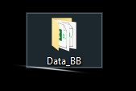  

Cada conjunto de datos fue nombrado bajo la nomenclatura *clasededatos_period(# periodo)* siendo el que hay 2 periodos de recoleccion.  

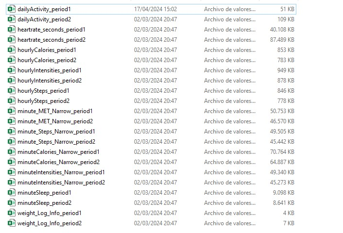  
Caracteristicas de los conjuntos:

* Han sido recolectados 22 conjuntos de datos en total , siendo en realidad 11 conjuntos que fueron divididos en 2 periodos de recoleccion distintos

* Los conjuntos de datos estan en formato Long

* Fueron descartados 7 conjuntos de datos pertenecientes al periodo 12-04-2016 al 12-05-2016 debido a la falta de datos por parte del periodo anterior

* Debido a limitaciones temporales , solo se estaran usando un maximo de 2 conjuntos de datos finales para etapas de analisis y visualizacion.  

Descripcion de los conjuntos utilizados:  

|Nombre del conjunto de datos|Descripcion|
|:--------------------------:|:----------:|
|dailyActivity_period[X]|Conjunto de datos que recolecta actividad diaria del usuario segun Id|
|heartrate_seconds_period[X]|Conjunto de datos que recolecta ritmo cardiaco por segundos|
|hourlyCalories_period[X]|Conjunto de datos que registra Calorias quemadas por hora|
|hourlyIntensities_period[X]|Conjunto de datos que registra la intensidad del ejercicio por hora|
|hourlySteps_period[X]|Conjunto de datos que registra pasos realizados por hora|
|minute_MET_Narrow_period[X]|Conjunto de datos que registra radio de ritmo metabolico angosto por minuto|
|minute_Steps_Narrow_period[x]|Conjunto de datos que registra pasos angostos por minuto|
|minuteCalories_Narrow_period[x]|Conjunto de datos que registra calorias quemadas por minuto|
|minute_Intensities_Narrow_period[X]|Conjunto de datos que registra intensidad del ejercicio angosto por minuto|
|minuteSleep_period[X]|Conjunto de datos de registra minutos de sueño|
|weight_Log_Info_period[X]|Conjunto de datos que registra peso del usuario por sesion|


## Fase Process
Para empezar con la fase de limpieza se hizo uso de la herramienta Excel para una rapida revision de los datos. Se notaron las siguientes caracteristicas:

* Conjuntos de datos como DailyActivity no conllevan tantas instancias y pueden ser cargadas en Excel.

* Gran parte de los conjuntos de datos contienen una cantidad de registros mayor al limite de excel dando el siguiente mensaje:

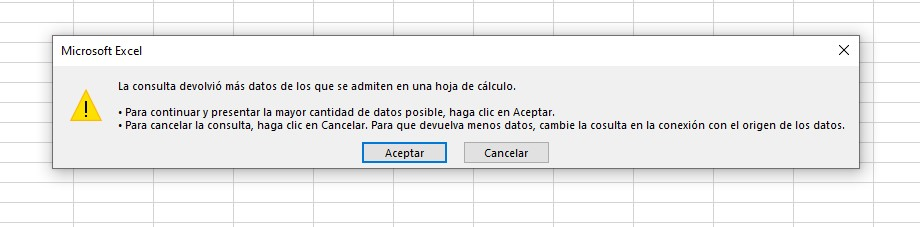  

* No se detectan datos nulos en gran parte de los conjuntos , en caso de que no haya registros simplemente el valor es dejado en 0 , lo que no representa realmente falta de datos sino que no hubo actividad registrada en esa fecha.  

Considerando lo mencionado , se indica lo siguiente:

* Se hara uso del Lenguaje R para la limpieza de datos , ya que se requiere juntar archivos CSV de forma sencilla y rapida.

* Debido al limite de Excel no es adecuado hacer uso de esta herramienta para un proceso de limpieza , en el caso de SQL este no admite el formato en el cual se registran las fechas en la importacion.

* El proceso de limpieza busca asegurar la integridad de los datos , en este caso , se requieren acciones para combinar datos , cambios de formatos y ordenamiento.

* Posterior al proceso de limpieza en R , se debe de llevar la carga de archivos a una base de datos en SQL Server  

### Limpieza en R
Para empezar el proceso de limpieza se debe empezar con la instalacion de librerias en el equipo  
```{r message=FALSE, warning=FALSE}
options(repos = "https://cloud.r-project.org")

install.packages("tidyverse")
install.packages("here")
install.packages("skimr")
install.packages("janitor")
```

Posterior a ello se cargan en el entorno  
```{r message=FALSE, warning=FALSE, include=FALSE}
library("tidyverse")
library("here")
library("skimr")
library("janitor")
```

Luego se debe realizar la carga de datos , con fines practicos se asigna la variable global ruta que contiene la ruta de almacenamiento como texto , no se mostrara su valor por razones de privacidad  
```{r message=FALSE, warning=FALSE, include=FALSE}
ruta <- "../Raw_data/"
```

```{r message=FALSE, warning=FALSE}
#Se reemplaza la ruta por la local
# ruta <- "ruta local o publica"

# Carga de todos los conjuntos de datos csv
da1 <- read_csv(paste(ruta,"dailyActivity_period1.csv",sep = ""))
da2  <- read_csv(paste(ruta,"dailyActivity_period2.csv",sep = ""))
hs1 <- read_csv(paste(ruta,"heartrate_seconds_period1.csv",sep = ""))
hs2 <- read_csv(paste(ruta,"heartrate_seconds_period2.csv",sep = ""))
hc1 <- read_csv(paste(ruta,"hourlyCalories_period1.csv",sep = ""))
hc2 <- read_csv(paste(ruta,"hourlyCalories_period2.csv",sep = ""))
hi1 <- read_csv(paste(ruta,"hourlyIntensities_period1.csv",sep = ""))
hi2 <- read_csv(paste(ruta,"hourlyIntensities_period1.csv",sep = ""))
hst1 <- read_csv(paste(ruta,"hourlySteps_period1.csv",sep = ""))
hst2 <- read_csv(paste(ruta,"hourlySteps_period2.csv",sep = ""))
mmn1 <- read_csv(paste(ruta,"minute_MET_Narrow_period1.csv",sep = ""))
mmn2 <- read_csv(paste(ruta,"minute_MET_Narrow_period2.csv",sep = ""))
mcn1 <- read_csv(paste(ruta,"minuteCalories_Narrow_period1.csv",sep = ""))
mcn2 <- read_csv(paste(ruta,"minuteCalories_Narrow_period2.csv",sep = ""))
min1 <- read_csv(paste(ruta,"minuteIntensities_Narrow_period1.csv",sep = ""))
min2 <- read_csv(paste(ruta,"minuteIntensities_Narrow_period2.csv",sep = ""))
ms1 <- read_csv(paste(ruta,"minuteSleep_period1.csv",sep = ""))
ms2 <- read_csv(paste(ruta,"minuteSleep_period2.csv",sep = ""))
wl1 <- read_csv(paste(ruta,"weight_Log_Info_period1.csv",sep = ""))
wl2 <- read_csv(paste(ruta,"weight_Log_Info_period2.csv",sep = ""))
mst1 <- read_csv(paste(ruta,"minute_Steps_Narrow_period1.csv",sep = ""))
mst2 <- read_csv(paste(ruta,"minute_Steps_Narrow_period2.csv",sep = ""))
```

Una vez realizada la carga de archivos , se procede a crear archivos ya unidos  
```{r warning=FALSE}
dailyActivity <- rbind(da1,da2)
heartrateSeconds <- rbind(hs1,hs2)
hourlyCalories <- rbind(hc1,hc2)
hourlyIntensities <- rbind(hi1,hi2)
hourlySteps <- rbind(hst1,hst2)
minuteMET <- rbind(mmn1,mmn2)
minuteSteps <- rbind(mst1,mst2)
minuteCalories <- rbind(mcn1,mcn2)
minuteIntensities <- rbind(min1,min2)
minuteSleep <- rbind(ms1,ms2)
weightInfo <- rbind(wl1,wl2)
```

### Analisis exploratorio de datos
Es necesario tener una vista previa de los conjuntos de datos antes de realizar algun cambio:  
```{r message=FALSE, warning=FALSE}
# Conjunto dailyActivity
head(dailyActivity)

#Conjunto de datos HeartrateSeconds
head(heartrateSeconds)

#Conjunto de datos HourlyCalories
head(hourlyCalories)

#Conjunto de datos HourlyIntensities
head(hourlyIntensities)

#Conjunto de datos HourlySteps
head(hourlySteps)

#Conjunto de datos MinuteMET
head(minuteMET)

#Conjunto de datos MinuteSteps
head(minuteSteps)

#Conjunto de datos MinuteCalories
head(minuteCalories)

#Conjunto de datos MinuteIntensities
head(minuteIntensities)

#Conjunto de datos MinuteSleep
head(minuteSleep)

#Conjunto de datos WeightLog
head(weightInfo)
```
Revisamos la estructura de cada conjunto de datos  
```{r message=FALSE, warning=FALSE}
str(dailyActivity)
str(heartrateSeconds)
str(hourlyCalories)
str(hourlyIntensities)
str(hourlySteps)
str(minuteMET)
str(minuteSteps)
str(minuteCalories)
str(minuteIntensities)
str(minuteSleep)
str(weightInfo)
```
Notamos que gran parte de los datos concuerdan con los tipos que representan , por lo que no se vera incluido algun proceso de transformacion de tipo. Antes de iniciar con ajustes de formato , veremos si los conjuntos de datos presentan gran cantidad de nulos.  
```{r message=FALSE, warning=FALSE}
sum(is.na(dailyActivity))
sapply(dailyActivity, function(x) sum(is.na(x)))

sum(is.na(heartrateSeconds))
sapply(heartrateSeconds, function(x) sum(is.na(x)))

sum(is.na(hourlyCalories))
sapply(hourlyCalories, function(x) sum(is.na(x)))

sum(is.na(hourlyIntensities))
sapply(hourlyIntensities, function(x) sum(is.na(x)))

sum(is.na(hourlySteps))
sapply(hourlySteps, function(x) sum(is.na(x)))

sum(is.na(minuteMET))
sapply(minuteMET, function(x) sum(is.na(x)))

sum(is.na(minuteSteps))
sapply(minuteSteps, function(x) sum(is.na(x)))

sum(is.na(minuteCalories))
sapply(minuteCalories, function(x) sum(is.na(x)))

sum(is.na(minuteIntensities))
sapply(minuteIntensities, function(x) sum(is.na(x)))

sum(is.na(minuteSleep))
sapply(minuteSleep, function(x) sum(is.na(x)))

sum(is.na(weightInfo))
sapply(weightInfo, function(x) sum(is.na(x)))
```
La mayoria de los conjuntos de datos no contienen columnas con valores nulos , a excepcion del conjunto weightInfo , que recolecta informacion del peso de los usuarios. Este conjunto presenta 96 valores nulos en la columna Fat , por lo tanto se decide:

* Eliminar la columna Fat debido a que el total de registros es de 100 siendo un 96% de datos faltantes

* Eliminar la columna ManualRecord , debido a que no aporta datos relevantes al analisis  

```{r message=FALSE, warning=FALSE}
#Con esto elegimos mantener el conjunto de datos a excepcion de las columnas Fat y IsManualReport
weightInfo <- select(weightInfo,-Fat, -IsManualReport)
```

Otro ajuste necesario es el de las fechas , ya que este se encuentra en un formato dd/mm/yyyy hh:mm:ss PM-AM . Lo mas comun seria ponerlo en un formato de 24 horas generico  

```{r message=FALSE, warning=FALSE}
# Conjunto de datos dailyActivity

# En esta linea se indica que la columna ActivityDate se interprete como fecha y el formato actual
dailyActivity$ActivityDate <- as_date(dailyActivity$ActivityDate,format="%m/%d/%Y")
#Esta linea modifica el formato a una mas generico
dailyActivity$ActivityDate <- format(dailyActivity$ActivityDate,"%d-%m-%Y")

#Esto se aplica para el resto de conjuntos , excepto que algunos seran de tipo datetime

# Conjunto de datos heartrateSeconds
heartrateSeconds$Time <- strptime(heartrateSeconds$Time,"%m/%d/%Y %I:%M:%S %p")
heartrateSeconds$Time <- format(heartrateSeconds$Time,"%Y-%m-%d %H:%M:%S")

# Conjunto de datos hourlyCalories
hourlyCalories$ActivityHour<- strptime(hourlyCalories$ActivityHour,"%m/%d/%Y %I:%M:%S %p")
hourlyCalories$ActivityHour <- format(hourlyCalories$ActivityHour,"%Y-%m-%d %H:%M:%S")

# Conjunto de datos hourlyIntensities
hourlyIntensities$ActivityHour<- strptime(hourlyIntensities$ActivityHour,"%m/%d/%Y %I:%M:%S %p")
hourlyIntensities$ActivityHour <- format(hourlyIntensities$ActivityHour,"%Y-%m-%d %H:%M:%S")

# Conjunto de datos hourlySteps
hourlySteps$ActivityHour<- strptime(hourlySteps$ActivityHour,"%m/%d/%Y %I:%M:%S %p")
hourlySteps$ActivityHour <- format(hourlySteps$ActivityHour,"%Y-%m-%d %H:%M:%S")

# Conjunto de datos minuteMET
minuteMET$ActivityMinute <- strptime(minuteMET$ActivityMinute,"%m/%d/%Y %I:%M:%S %p")
minuteMET$ActivityMinute <- format(minuteMET$ActivityMinute,"%Y-%m-%d %H:%M:%S")

# Conjunto de datos minuteSteps
minuteSteps$ActivityMinute <- strptime(minuteSteps$ActivityMinute ,"%m/%d/%Y %I:%M:%S %p")
minuteSteps$ActivityMinute <- format(minuteSteps$ActivityMinute,"%Y-%m-%d %H:%M:%S")

# Conjunto de datos minuteCalories
minuteCalories$ActivityMinute <- strptime(minuteCalories$ActivityMinute ,"%m/%d/%Y %I:%M:%S %p")
minuteCalories$ActivityMinute <- format(minuteCalories$ActivityMinute,"%Y-%m-%d %H:%M:%S")

# Conjunto de datos minuteIntensities
minuteIntensities$ActivityMinute <- strptime(minuteIntensities$ActivityMinute ,"%m/%d/%Y %I:%M:%S %p")
minuteIntensities$ActivityMinute <- format(minuteIntensities$ActivityMinute,"%Y-%m-%d %H:%M:%S")

# Conjunto de datos minuteSleep
minuteSleep$date <- strptime(minuteSleep$date ,"%m/%d/%Y %I:%M:%S %p")
minuteSleep$date <- format(minuteSleep$date,"%Y-%m-%d %H:%M:%S")

# Conjunto de datos weightInfo
weightInfo$Date <- strptime(weightInfo$Date,"%m/%d/%Y %I:%M:%S %p")
weightInfo$Date <- format(weightInfo$Date,"%Y-%m-%d %H:%M:%S")
```

El ultimo cambio por parte de R seria el cambio de nombre en ciertas columnas , para brindar mejor formato y claridad en cada conjunto de datos  
```{r message=FALSE, warning=FALSE}
# Conjunto de datos dailyActivity
colnames(dailyActivity) #No hay cambios , formatos aptos

# Conjunto de datos heartrateSeconds
colnames(heartrateSeconds)
names(heartrateSeconds) <- c("Id","Record","Heartrate")

# Conjunto de datos hourlyCalories
colnames(hourlyCalories)
names(hourlyCalories) <- c("Id","Record","Calories")

# Conjunto de datos hourlyIntensities
colnames(hourlyIntensities)
names(hourlyIntensities) <- c("Id","Record","Total_Intensity" , "Avg_Intensity")

# Conjunto de datos hourlySteps
colnames(hourlySteps)
names(hourlySteps) <- c("Id","Record","Total Steps")

# Conjunto de datos minuteMET
colnames(minuteMET)
names(minuteMET) <- c("Id","Record","METs")

# Conjunto de datos minuteSteps
colnames(minuteSteps)
names(minuteSteps) <- c("Id","Record","Steps")

# Conjunto de datos minuteCalories
colnames(minuteCalories)
names(minuteCalories) <- c("Id","Record","Calories")

# Conjunto de datos minuteIntensities
colnames(minuteIntensities)
names(minuteIntensities) <- c("Id","Record","Intensity")

# Conjunto de datos minuteSleep
colnames(minuteSleep)
names(minuteSleep) <- c("Id","Record","Value","LogId")

# Conjunto de datos weightInfo
colnames(weightInfo)
names(weightInfo) <- c("Id","Record","Weight Kg","Weight Pounds","BMI")

```

El cambio mas relevante es el de colocar cada registro de fecha como Record , esto debido a que colocar Date no es algo correcto , pues cada dato representa una instancia de registro que puede contener varias veces una misma fecha en distintos periodos de tiempo.  

Finalmente , se cargan los conjuntos de datos a la ruta de almacenamiento local:
```{r message=FALSE, warning=FALSE}
write.csv(dailyActivity,paste("../Data/","DailyActivity.csv",sep = ""),row.names=FALSE)
write.csv(heartrateSeconds,paste("../Data/","HeartrateSeconds.csv",sep = ""),row.names=FALSE)
write.csv(hourlyCalories,paste("../Data/","HourlyCalories.csv",sep = ""),row.names=FALSE)
write.csv(hourlyIntensities,paste("../Data/","HourlyIntensities.csv",sep = ""),row.names=FALSE)
write.csv(hourlySteps,paste("../Data/","HourlySteps.csv",sep = ""),row.names=FALSE)
write.csv(minuteMET,paste("../Data/","MinuteMET.csv",sep = ""),row.names=FALSE)
write.csv(minuteSteps,paste("../Data/","MinuteSteps.csv",sep = ""),row.names=FALSE)
write.csv(minuteCalories,paste("../Data/","MinuteCalories.csv",sep = ""),row.names=FALSE)
write.csv(minuteIntensities,paste("../Data/","MinuteIntensities.csv",sep = ""),row.names=FALSE)
write.csv(minuteSleep,paste("../Data/","MinuteSleep.csv",sep = ""),row.names=FALSE)
write.csv(weightInfo,paste("../Data/","WeightInfo.csv",sep = ""),row.names=FALSE)
```

### Carga en SQL Server

Para este caso de estudio , se eligio realizar la fase Analize en SQL Server , un sistema gestor bastante comun y de uso empresarial , haciendo uso de SQL Server Management Studio se hizo la carga de los archivos CSV considerando:

* El uso del Wizard para archivos planos CSV
* El uso del wizard para carga de datos general  

La razon por la que no fue usada solo una opcion fue debido a ciertos inconvenientes:

* En la carga de archivos CSV , se reconocen los datos datetime como datetime2 sin ningum problema , pero no reconoce los datos con punto decimal (.) correctamente.

* En la carga de datos general si se reconocen los tipos de datos con punto decimal de forma correcta , pero los datos de tipo fecha no son reconocidos.

A continuacion , se detalla el proceso a seguir para cada archivo CSV:  

1. Crear una base de datos , para nuestro caso se crea una base de datos llamada DMT_BB (DataMart Bellabeat)

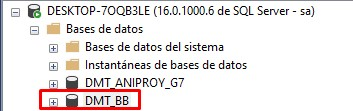  
2. Usaremos la opcion para carga de archivos CSV: 

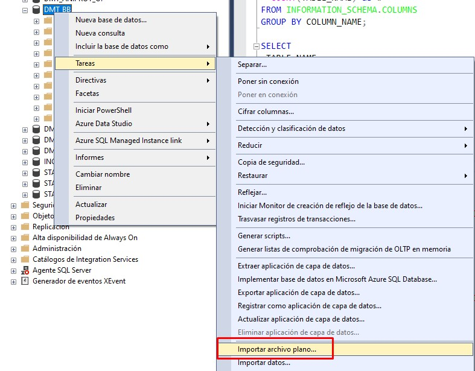  
Esta opcion se usara para los siguientes archivos:

* HeartrateSeconds.csv
* HourlyCalories.csv
* HourlySteps.csv
* MinuteIntensities.csv
* MinuteMET.csv
* MinuteSteps.csv
* MinuteSleep.csv  

3. Configurar la clase de datos , solamente es seleccionar el tipo de dato en cada columna usualmente el mayor cambio sera pasar de un INT a Bigint o de un tinyint a INT dependiendo del caso

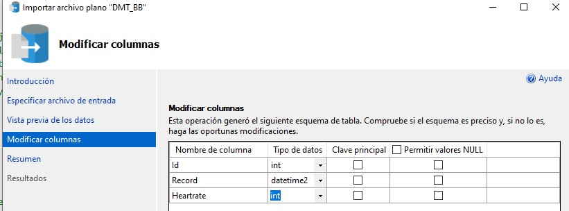  

4. Usar la opcion para carga de datos generica:

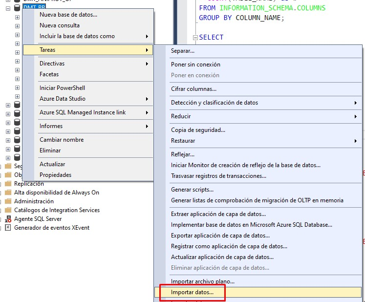  
Esta opcion se usara para los siguientes archivos:

* HourlyIntensities.csv
* DailyActivity.csv
* MinuteCalories.csv
* WeightInfo.csv

5. Configuracion de origen , aqui deben configurarse:

* Origen de los datos , que en este caso es "Archivo plano"
* Region , para reconocer datos con punto decimal (.) elegir Ingles(Australia)

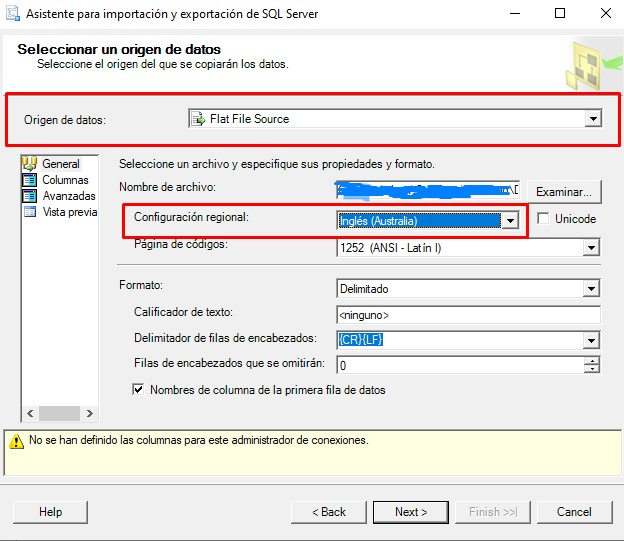  
6. Configurar conexion a servidor SQL Server:

Seleccionar la opcion Microsoft OLE DB Provider for SQL Server , marcar "Usar autenticacion SQL Server" e ingresar credenciales y la base de datos creada

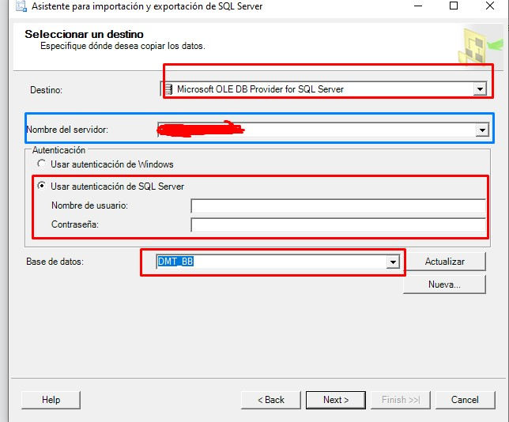  
Luego de ello se debera finalizar las opciones del wizard , es necesario verificar los tipos de datos como en el paso (3)

7. Modificar las columnas de fecha con un script SQL , esto netamente debe de ejecutarse una vez
ya que es para la conversion a fechas solo de 4 tablas:

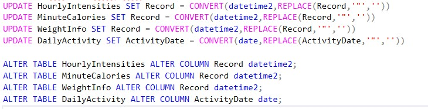  
Con esos comandos , el tipo de dato sera cambiado a tipo date/datetime2 en la tabla original

8. Verificar que la base de datos cuente con todas las tablas cargadas

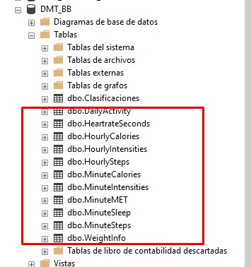  
Con esta ultima operacion , la fase Process ha sido concluida con exito y se puede proceder a un analisis mediante SQL Server.

## Fase Analyze

Para el analisis se hizo uso de SQL Server como Sistema Gestor de Base de Datos , es importante considerar que:

* Se debe de configurar una coneccion a la base de datos en caso se desee proceder en un mismo script de R

* Solo se realizo un analisis en las tablas HeartRate Seconds y HourlyCalories por limitaciones temporales  

```{r message=FALSE, warning=FALSE, include=FALSE}
install.packages('DBI')
install.packages('odbc')

library('DBI')
library('odbc')

my_connection <-dbConnect(
  odbc::odbc(),
  Driver = "SQL Server",
  Server = "DESKTOP-7OQB3LE",
  Database = "DMT_BB",
  UID = "sa",
  PWD = "chester2001"
)

```

```{r message=FALSE, warning=FALSE}
# De seguir con R , se debe configurar la conexion a la propia base de datos:
# Instalacion de librerias para conexion SQL
# install.packages('DBI')
# install.packages('odbc')
# 
# #Carga de las librerias
# library(DBI)
# library(odbc)
# 
# # Establecer la conexión a la base de datos SQL Server
# sql_connection <- dbConnect(
#   odbc::odbc(),
#   Driver = "SQL Server",
#   Server = "nombre_del_servidor",
#   Database = "nombre_de_la_base_de_datos",
#   UID = "usuario",
#   PWD = "contraseña"
# )

```


El analisis empieza con la revision del nombre de columnas en toda la base de datos:  
```{sql connection=my_connection}
SELECT	
  COLUMN_NAME,
  COUNT(TABLE_NAME) as #
FROM INFORMATION_SCHEMA.COLUMNS
GROUP BY COLUMN_NAME;
```
La columna que mas se presenta en la base de datos es Id , lo que significa que la carga ha sido igual para todos los conjuntos de datos , otro dato a resaltar es el Record , presente en todas las tablas como el registro de tiempo a excepcion de la tabla ActivityDate  

```{sql connection=my_connection}
SELECT
 TABLE_NAME,
 SUM(CASE
	 WHEN COLUMN_NAME = 'Id' THEN 1
	 ELSE
	 0
	 END ) AS has_id_column
FROM INFORMATION_SCHEMA.COLUMNS
GROUP BY TABLE_NAME
ORDER BY TABLE_NAME ASC;
```
Verificar si todas las tablas contienen algun dato de fecha o tiempo  

```{sql connection=my_connection}
SELECT
 TABLE_NAME,
 SUM(CASE
	 WHEN data_type IN ('TIMESTAMP','DATETIME','DATETIME2','TIME','DATE') THEN 1
	 ELSE
	 0
	 END) AS has_time_info
FROM INFORMATION_SCHEMA.COLUMNS
GROUP BY TABLE_NAME
HAVING SUM(CASE
	 WHEN data_type IN ('TIMESTAMP','DATETIME','DATETIME2','TIME','DATE') THEN 1
	 ELSE
	 0
	 END) = 0;
```
En este caso , sysdiagrams es solo una tabla propia del sistema por lo que todas nuestras tablas cuentan con datos temporales adecuadamente. Para mayor detalle se obtiene:  

```{sql connection=my_connection}
SELECT
 CONCAT(TABLE_CATALOG,'.', TABLE_SCHEMA ,'.', TABLE_NAME) AS table_path,
 TABLE_NAME,
 COLUMN_NAME
FROM INFORMATION_SCHEMA.COLUMNS
WHERE
	DATA_TYPE IN ('TIMESTAMP','DATETIME','DATETIME2','DATE');
```
Habiendo comprobado la integridad de los datos , procedemos con el analisis limitado a las tablas:

* HeartrateSeconds: Registra el ritmo cardiaco de usuario por segundo
* HourlyCalories: Registra la quema de calorias de usuario por hora  

### Analisis de HeartrateSeconds

Inicia con la vista previa de la tabla  
```{sql connection=my_connection}
SELECT 
 *
FROM
 HeartrateSeconds
```

Descubrir el promedio de ritmo cardiaco por usuario en todo el periodo de recoleccion:  
```{sql connection=my_connection}
SELECT
	Id,
	AVG(Heartrate) as Avg_Heartrate
FROM HeartrateSeconds
GROUP BY Id
```
Notamos que gran parte de los usuarios ha mantenido un ritmo cardiaco habitual para adultos en todo el tiempo de recoleccion de datos , siendo el minimo un ritmo de 66 y uno maximo de 94.   

Hay que resaltar que segun estandares medicos , los adultos deben contemplar ritmos cardiacos entre 60 a 100 , de no contemplarse en estos limites puede representar complicaciones cardiacas.  

```{sql connection=my_connection}
SELECT
	Id,
	AVG(Heartrate) as AVG_Heartrate,
	CASE
		WHEN AVG(Heartrate) < 60 THEN 'Low Heartrate'
		WHEN AVG(Heartrate) BETWEEN 60 AND 100 THEN 'Normal Heartrate'
		WHEN AVG(Heartrate) > 100 THEN 'High Heartrate'
		ELSE 'ERROR'
	END AS Class_by_Heartrate
FROM HeartrateSeconds
GROUP BY Id
ORDER BY AVG(Heartrate)
```

En esta consulta , parece que durante todo el tiempo de recoleccion la mayoria de nuestros usuarios presenta un ritmo cardiaco normal , lo esperado de adultos con una rutina de ejercicio comun.    

Sin embargo , no seria apropiado concluir con un periodo de tiempo tan amplio ; por lo que , seria mejor ver la tendencia en dias  

```{sql connection=my_connection}
SELECT
    Id,
    CAST(Record AS DATE) AS heartrate_day,
    AVG(Heartrate) AS avg_heartrate_per_day
FROM
    HeartrateSeconds
GROUP BY
    Id,
    CAST(Record AS DATE)
ORDER BY Id , CAST(Record AS DATE)
```

Notamos que si un usuario ya presenta un rango de valores en su ritmo cardiaco , este tiende a mantenerse en el resto de dias. Ello es visible con usuarios como el **2022484408** que mantiene su rango de valores entre 70 - 90 o el usuario **5553957443** que presenta menores valores entre 60 - 75 . Esto no quiere decir que el usuario **2022484408** realiza mayor ejercicio que **5553957443** pero nos da es un indicador inicial del estilo de vida entre cada usuarios y de posibles condiciones fisicas.  

Un analisis a detalle entre periodos de tiempo , podria otorgar una mejor aclaracion de los resultados previos:  
```{sql connection=my_connection}
DECLARE 
	@MORNING_START NVARCHAR(12),
	@MORNING_END NVARCHAR(12),
	@AFTERNOON_END NVARCHAR(12),
	@EVENING_END NVARCHAR(12);

SET @MORNING_START = '06:00:00:000000';
SET @MORNING_END = '12:00:00:000000';
SET @AFTERNOON_END = '18:00:00:000000';
SET @EVENING_END = '21:00:00:000000';

WITH
dow_heartrate_summary AS (
	SELECT
		Id,
		DATEPART(WEEKDAY,Record) as dow_number,
		DATENAME(WEEKDAY,Record) as day_of_week,
		CASE
            WHEN DATENAME(WEEKDAY, Record) IN ('Domingo', 'Sábado') THEN 'Weekend'
            WHEN DATENAME(WEEKDAY, Record) NOT IN ('Domingo', 'Sábado') THEN 'Weekday'
            ELSE 'ERROR'
        END AS part_of_week,
		CASE
            WHEN CAST(Record AS TIME) BETWEEN CAST(STUFF(@MORNING_START,9,1,'.') AS TIME) AND CAST(STUFF(@MORNING_END,9,1,'.') AS TIME) THEN 'Morning'
            WHEN CAST(Record AS TIME) BETWEEN CAST(STUFF(@MORNING_END,9,1,'.') AS TIME) AND CAST(STUFF(@AFTERNOON_END,9,1,'.') AS TIME) THEN 'Afternoon'
            WHEN CAST(Record AS TIME) BETWEEN CAST(STUFF(@AFTERNOON_END,9,1,'.') AS TIME) AND CAST(STUFF(@EVENING_END,9,1,'.') AS TIME) THEN 'Evening'
            WHEN CAST(Record AS TIME) >= CAST(STUFF(@EVENING_END,9,1,'.') AS TIME)
                 OR CAST(CAST(Record AS TIME) AS DATETIME) <= CAST(CAST(STUFF(@MORNING_START,9,1,'.') AS TIME) AS DATETIME) THEN 'Night'
            ELSE 'ERROR'
        END AS time_of_day , 
		AVG(Heartrate) as AVG_Heartrate_per_period
	FROM HeartrateSeconds
	GROUP BY 
	Id,
	DATEPART(WEEKDAY,Record),
		DATENAME(WEEKDAY,Record),
		CASE
            WHEN DATENAME(WEEKDAY, Record) IN ('Domingo', 'Sábado') THEN 'Weekend'
            WHEN DATENAME(WEEKDAY, Record) NOT IN ('Domingo', 'Sábado') THEN 'Weekday'
            ELSE 'ERROR'
        END,
		CASE
            WHEN CAST(Record AS TIME) BETWEEN CAST(STUFF(@MORNING_START,9,1,'.') AS TIME) AND CAST(STUFF(@MORNING_END,9,1,'.') AS TIME) THEN 'Morning'
            WHEN CAST(Record AS TIME) BETWEEN CAST(STUFF(@MORNING_END,9,1,'.') AS TIME) AND CAST(STUFF(@AFTERNOON_END,9,1,'.') AS TIME) THEN 'Afternoon'
            WHEN CAST(Record AS TIME) BETWEEN CAST(STUFF(@AFTERNOON_END,9,1,'.') AS TIME) AND CAST(STUFF(@EVENING_END,9,1,'.') AS TIME) THEN 'Evening'
            WHEN CAST(Record AS TIME) >= CAST(STUFF(@EVENING_END,9,1,'.') AS TIME)
                 OR CAST(CAST(Record AS TIME) AS DATETIME) <= CAST(CAST(STUFF(@MORNING_START,9,1,'.') AS TIME) AS DATETIME) THEN 'Night'
            ELSE 'ERROR'
        END
)
/*Insert into temp Table*/
SELECT *
INTO #dow_summary_for_heartrate
FROM dow_heartrate_summary

/*Summary preview*/
SELECT * FROM #dow_summary_for_heartrate

/*Point 1*/	
SELECT
	part_of_week,
	day_of_week,
	time_of_day,
	AVG(AVG_Heartrate_per_period) AS avg_in_period
FROM #dow_summary_for_heartrate
GROUP BY
	part_of_week,
	day_of_week,
	time_of_day
ORDER BY day_of_week

/*Point 2*/	
SELECT
	day_of_week,
	AVG(AVG_Heartrate_per_period) AS avg_in_day
FROM 
	#dow_summary_for_heartrate
GROUP BY
	day_of_week

/*Point 3*/	
SELECT
	time_of_day,
	AVG(AVG_Heartrate_per_period) AS avg_per_time
FROM 
	#dow_summary_for_heartrate
GROUP BY
	time_of_day

/*Point 4*/
SELECT
	part_of_week,
	AVG(AVG_Heartrate_per_period) AS avg_per_week_part
FROM 
	#dow_summary_for_heartrate
GROUP BY
	part_of_week
```

Esta consulta permite desarrollar un esquema resumido que muestra los ritmos cardiacos entre periodos distintos del dia , todo ello sera almacenado en una tabla temporal para mas comodidad.   

Consideramos algunos puntos:

1. En un principio , se nota como el promedio en todos los periodos tiende a valores entre 70-85 , valores normales considerando la rutina de un adulto activo. Pero notamos algo , el ritmo cardiaco suele ser mayor en las tardes y noches de cada dia , ademas los dias que presentan un mayor valor son justamente los que forman parte del fin de semana.

2. Si promediamos por dia , todos tienen un valor comun de 78 a excepcion del domingo y martes con promedios de 79. Para validar nuestra hipotesis anterior , seria mejor agrupar por periodos del dia:

3. Tal como se supuso , las tardes y noches presentan un mayor ritmo cardiaco promedio , esto puede representar que estos periodos son los de mayor actividad ritmica entre usuarios , verifiquemos en el caso de los periodos de la semana:

4. No hay mucha diferencia entre dias y fines de semana como se supuso , al menos en promedio.  

Podemos denotar algunos puntos del analisis de Heartrate Seconds:

* El ritmo cardiaco de los usuarios no parece presentar anomalias cardiacas tanto bajas como altas , lo que supone que los usuarios llevan un estilo de vida saludable en la adultez.

* La tendencia de ritmo cardiaco entre usuarios se mantiene a lo largo de los dias , sin presentar muchas anomalias.

* El ritmo cardiaco no representa necesariamente una mayor realizacion de ejercicio pero sirve como un indicador potencial del estado de salud de los usuarios que puede ser relacionado.

* Los periodos de mayor aumento son en las tardes y noches con un pico algo mayor en fines de semana , si bien no representa obligatoriamente mayor ejercicio fisico en estos periodos , es un indicador potencial de mayor actividad.  

### Analisis de HourlyCalories

Este conjunto de datos representa el registro de calorias quemadas por hora , empezamos viendo cuantos usuarios fueron registrados:  

```{sql connection=my_connection}
SELECT 
DISTINCT
	Id
FROM
	HourlyCalories
```

Hay por lo menos 35 usuarios que fueron registrados, sobre la quema de calorias se tiene:

* Segun estandares de salud , una quema de calorias para adultos activos es entre 2000 y 3000
* Una quema menor a 2000 podria representar un deficit de ejercicio o estilo sedentario
* Una quema mayor a 3000 podria representar un sobreesfuerzo que puede llevar a complicaciones de salud  

Por ello , es conveniente agrupar la quema de calorias por dia en tres categorias  
```{sql connection=my_connection}
SELECT
	Id,
	CAST(RECORD AS Date) as fecha_cal,
	SUM(Calories) as calorias_por_dia,
	CASE
		WHEN SUM(Calories) < 2000 THEN 'Quema baja de calorias'
		WHEN SUM(Calories) BETWEEN 2000 AND 3000 THEN 'Quema moderada de calorias'
		WHEN SUM(Calories) > 3000 THEN 'Quema alta de calorias'
	END AS clasificacion
FROM
	HourlyCalories
GROUP  BY Id, CAST(Record as DATE)
ORDER BY Id , CAST(Record as DATE)
```

A simple vista , se puede deducir que no se sigue una tendencia por usuario ya que se ve como el mismo usuario contempla dias donde hay quemas moderadas o bajas , lo que tiene sentido pues no se realiza ejercicio fisico al mismo nivel o de la misma forma en cada dia. Resaltar que el valor que parece repetirse menos es de 'Quema alta'.  

Lo mas apropiado , seria ver cuantas veces cada usuario a ello una quema baja , moderada o alta y ello se puede lograr por medio de una subconsulta y colocar los resultados en una tabla temporal  

```{sql connection=my_connection}
SELECT
	Id,	
	clasificacion,
	COUNT(*) as number_class
INTO #user_cal_classification
FROM (
	SELECT
		Id,
		CAST(RECORD AS Date) as fecha_cal,
		SUM(Calories) as calorias_por_dia,
		CASE
			WHEN SUM(Calories) < 2000 THEN 'Quema baja de calorias'
			WHEN SUM(Calories) BETWEEN 2000 AND 3000 THEN 'Quema moderada de calorias'
			WHEN SUM(Calories) > 3000 THEN 'Quema alta de calorias'
		END AS clasificacion
	FROM
		HourlyCalories
	GROUP  BY Id, CAST(Record as DATE)
) daily_cal_table
GROUP BY Id, clasificacion

/*Preview of summary*/	
SELECT * FROM #user_cal_classification ORDER BY Id

/*Point 1 and 2*/	
SELECT 
	Id,
	clasificacion,
	number_class
FROM (
	SELECT
		Id,
		clasificacion,
		number_class,
		ROW_NUMBER() OVER (PARTITION BY Id ORDER BY number_class DESC) AS max_class
	FROM
		#user_cal_classification
) freq_table
WHERE max_class = 1
ORDER BY Id

/*Point 3*/	
SELECT 
	clasificacion,
	COUNT(*) as class_freq
FROM (
	SELECT
		Id,
		clasificacion,
		number_class,
		ROW_NUMBER() OVER (PARTITION BY Id ORDER BY number_class DESC) AS max_class
	FROM
		#user_cal_classification
) freq_table
WHERE max_class = 1
GROUP BY clasificacion
```

Notamos como gran parte de los usuarios queman calorias de forma baja o moderada , aunque si hay usuarios presentes con una quema alta de calorias. Ademas si sumamos el numero de registros por clase el maximo sera 62 , concordando en que el periodo de recoleccion fue de 62 dias.  

Algo notable , es que no todos los usuarios presentan necesariamente registros que suman 62 , como el caso del usuario **2891001357** que solo registro una 'quema baja' en todo el periodo. Esto nos obliga a recuperar el maximo de otra forma , extrayendo la frecuencia por usuario.  

1. Si deseamos saber que clase se da con mas frecuencia , es decir que clase de quema es mas frecuente entre nuestros usuarios debemos recuperar aquella con frecuencia maxima por usuario:

2. Confirmamos algunos puntos al ver:

* La quema alta solo parece ser mas frecuente en 5 usuarios
* La quema baja y moderada parecen estar a la par , representando una rutina saludable en mayoria de los usuarios.  

3. Con esta ultima consulta , podemos evaluar algunos puntos del analisis:

* No hay una tendencia clara entre las quemas de calorias por usuario , ya que una rutina de ejercicio puede no tener el mismo gasto entre dias.

* La mayoria de los usuarios realizan rutinas con una quema de calorias menor a 2000 , ello no representa necesariamente sedentarismo pero seria apropiado evaluar un aumento de intensidad

* No obstante, al menos el 40% (14 usuarios) presentan una quema de calorias moderada lo que da a entender que sus rutinas cumplen con estandares adecuados para la vida adulta.

* Muy pocos usuarios presentan quema alta de calorias , lo que podria reflejar un sobreesfuerzo de ejercicio , la advertencia de este mismo puede resultar en posibles caracteristicas a implementar.

Esta fase nos ha dado a entender datos interesantes para conocer el comportamiento del publico objetivo , en la siguiente fase Share es posible confirmar estas hipotesis.

## Fase Share
Para esta fase se eligio usar Tableu como herramienta de visualizacion , el producto final se puede visualizar en este enlace:  

[Bellabeat Case](https://public.tableau.com/views/Bellabeat_case/Hearratedashboard?:language=es-ES&:sid=&:display_count=n&:origin=viz_share_link)  

### Visualizaciones de Heartrate

Uno de los primeros graficos realizados es una tabla de apoyo , que practicamente es un elemento para corroborar datos en futuras visualizaciones , un ejemplo seria la tabla de clasificaciones de ritmo cardiaco en todo el periodo:  

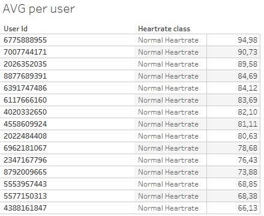   
Esta tabla corrobora una deduccion previa , los usuarios presentan ritmos cardiacos normales en todo el periodo de recoleccion.  

Lo ideal para corroborar la hipotesis anterior: *"La tendencia de ritmo cardiaco entre usuarios se mantiene a lo largo de los dias , sin presentar muchas anomalias"* es realizar un grafico de linea a lo largo del tiempo:  

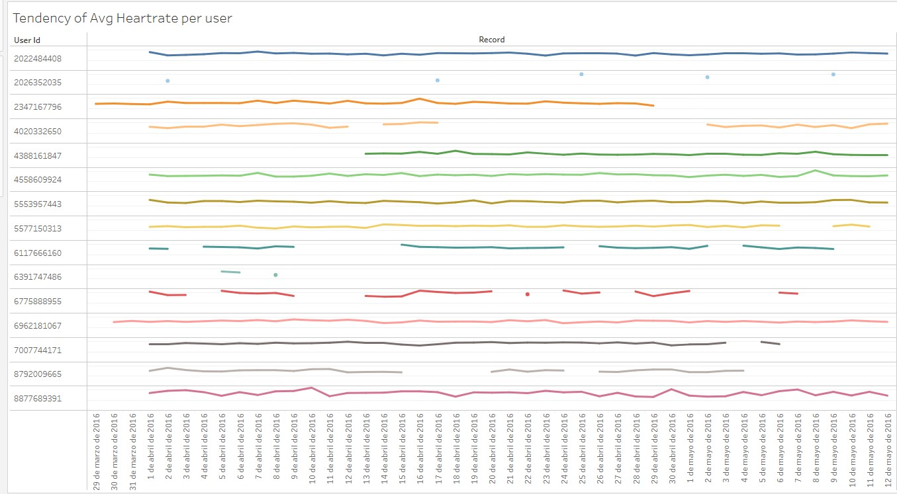  
De inmediato , confirmamos que realmente en cuanto a ritmo cardiaco no hay picos ni caidas resaltantes por cada usuario ya que se ha mantenido un promedio a lo largo de todo el periodo de datos. Aunque ahora es mas notable que no todos los usuarios registraron adecuadamente este dato como el usuario **2026352035** y otros donde se nota una interrupcion ; sin embargo , es suficiente para corroborar nuestra suposición.  

Tambien incluimos un grafico de barras por periodo para corrobar que las tardes y noches son periodos con mayor ritmo cardiaco:  

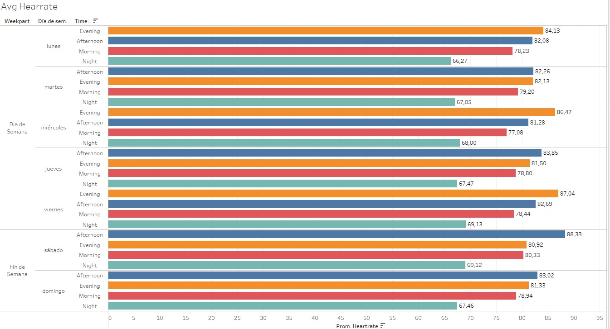  
Este grafico fue ordenado de forma descendente , confirmando que los periodos de tarde y noche son donde mayor promedio de ritmo cardiaco es presente. Tambien afirmamos que los periodos de madrugada son los mas bajos , algo de esperar ya que al ser personas adultas no se espera mucha actividad en esas horas.  

Mediante estas visualizaciones hemos confirmado las hipotesis anteriores del analisis HeartrateSeconds ademas de encontrar algunas observaciones en nuestro datos no contempladas como la falta de registros en algunos usuarios.  

### Visualizaciones de HourlyCalories

Para este conjunto de datos es importante el seguimiento de quema de calorias a lo largo del tiempo , por lo que un mapa de calor para valores minimo y maximo es lo ideal:  

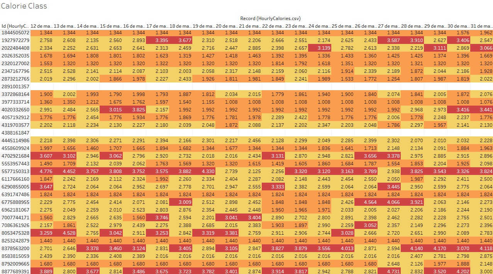  
De esta muestra del grafico original , se tiene la quema de calorias diaria por usuario a lo largo del tiempo , este cuenta con tres colores siendo:  

* Naranja si la quema de calorias fue baja (<2000)
* Amarilla si la quema de calorias fue moderada (Entre 2000 y 3000)
* Roja si la quema de calorias fue alta (>3000)  

En la muestra , se nota resalta como la gran mayoria presente una quema de calorias entre moderada y baja mientras que el color rojo no es dominante en la tabla. Ademas , notamos que hay registros en blanco , lo que quiere decir que no hubo registro en esa fecha.  

Para confirmar la hipotesis de que predominan la quema moderada y baja sobre la alta se desarrollo un grafico de cajas:  

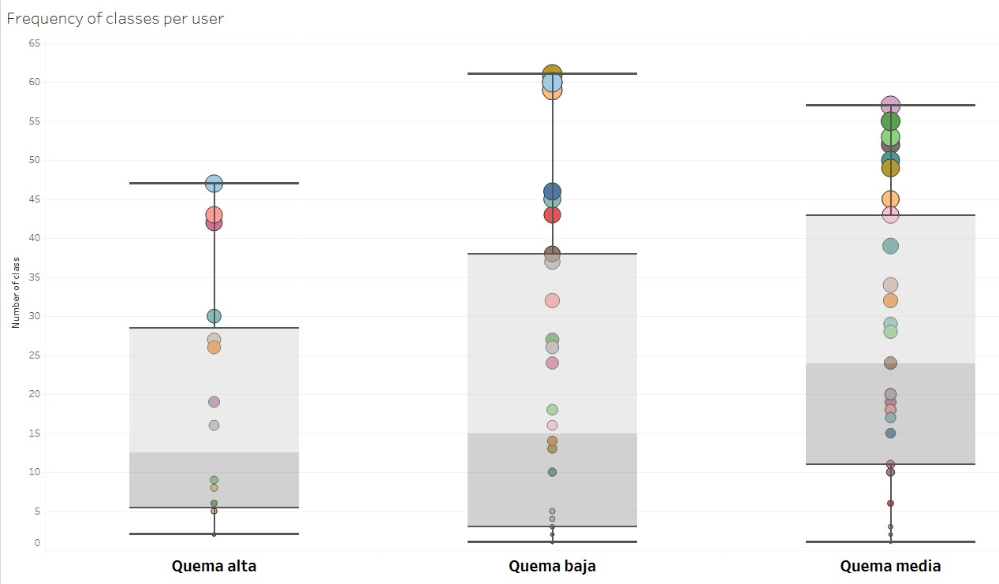  
Este grafico considera el numero de veces a las que un usuario pertenecio a una clase siendo:  

* El color de la bola , representa el id del usuario
* El tamaño representa cuantas veces estuvo en esa clase
* El eje Y representa el numero de veces , siendo el centro de bola alineado al valor.
* La caja representa los valores donde hay mayor distribucion  

Notamos como la Quema baja contiene gran cantidad de valores de considerable tamaño pero fuera de la distribucion normal , contando con mayor afluencia en promedio entre 5 - 35 recuentos. De hecho , es notable como la Quema moderada es aquella que realmente cuenta con una frecuencia de valores altos que supera la quema baja , aunque claro un menor numero de usuarios en general.  

Para finalizar , corroboramos la distribucion de mayor frecuencia de clase por usuario con un grafico torta:  

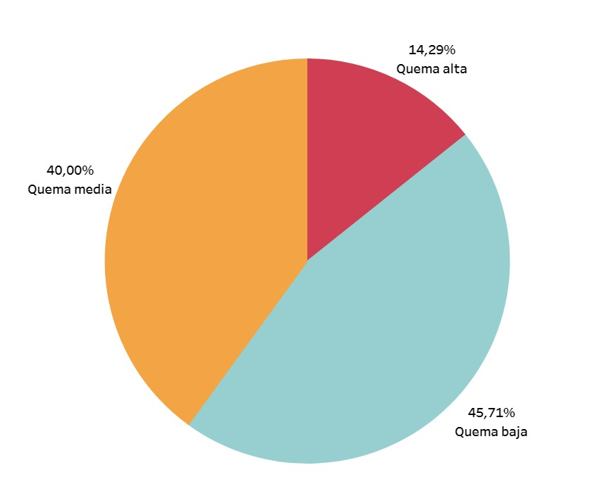  
Con este grafico , se confirma que la quema baja es una clase mas frecuente con 45.71% de repeticion siendo un 5.71% mayor a la Quema media . La quema alta no representa gran porcentaje de los usuarios.  

Con estas visualizaciones se nos deja en claro lo siguiente:

* No todos los usuarios han registrado continuamente su quema de calorias , dejando cierta ambiguedad para el analisis.

* Si bien la mayoria de hipotesis anteriores fueron confirmadas , hay que denotar que la distribucion de datos refleja otro hecho. Pues , si bien la Quema baja puede ser mas frecuente la Quema media resulta repetirse mucho mas dias por un mayor numero de usuarios que la Quema baja.  

### Fase Act

Habiendo finalizado el caso de estudio , se tienen las siguiente conclusiones:  

* El ritmo cardiaco de usuarios usualmente seguida una tendencia por usuario , sin presentar anomalias.

* Se denota un mayor promedio de ritmo cardiaco en las tardes y noches , representando una posibilidad de que el ejercicio es mayor en estos tiempos.

*La quema de calorias no tiene una tendencia exacta , pues los valores de quema diarios tienen gran variacion por usuario.

* Los usuarios suelen presentar mas frecuentemente una quema de calorias baja ; sin embargo , aquellos que suelen presentar una quema moderada de calorias suelen mantenerla durante mayores periodos de tiempo.  

Se recomienda a la empresa Bellabeat y a la sstakeholder Urška Sršen lo siguiente:  

* Realizar un estudio del ejercicio en periodos de dia y noche para corroborar que estos
periodos sean los de mayor ejercicio.

* Es factible una linea de productos enfocada a periodos nocturnos para el publico objetivo.

* Implementar caracteristicas enfocadas a la quema de calorias en productos Bellabeat con el fin de advertir un sobreesfuerzo o de aumentar la intensidad de ejercicio , resultando en mayor adquisicion de otros productos bellabeat relacionados.

* Realizar un estudio enfocado a la quema de calorias , con posibilidad de iniciar una campaña en el cuidado fisico sobre la quema de calorias.  

Se han contemplado las siguientes limitaciones:  

* No todos los usuarios han registrado sus datos en todo el periodo de tiempo , lo que puede resultar en ambiguedad.

* No se tienen datos sobre la condicion fisica de los usuarios , limitando el analisis y sus hipotesis.

* El periodo de recoleccion fue de 62 dias calendario , este periodo puede ser considerado corto para objetivos de largo plazo.  

## Anexos

Repositorio del caso de estudio: https://github.com/ZDev-19/CaseStudyBellabeat.git
Dashboard en Tableu Public:https://public.tableau.com/views/Bellabeat_case/Hearratedashboard?:language=es-ES&:sid=&:display_count=n&:origin=viz_share_link


